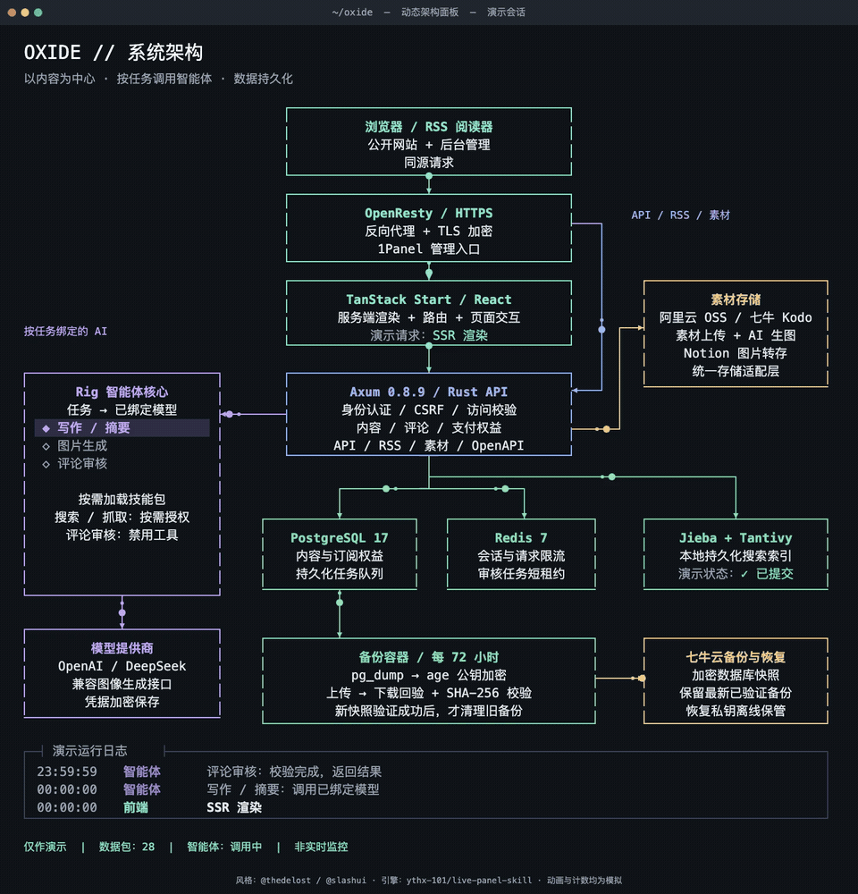

# Oxide

一个以写作和阅读为中心的单作者博客，内置内容管理、小册订阅、素材库与任务型 AI Agent。

React + TanStack Start 负责公开页面、管理端和服务端渲染；Rust + Axum 提供 API 与业务校验。PostgreSQL 保存业务数据，Redis 管理会话和限流，jieba-rs + Tantivy 提供中文持久化搜索。

[在线站点](https://kmod.cn/) · [架构说明](docs/architecture.md) · [API 文档](docs/api.md) · [部署指南](deploy/README.md) · [备份与恢复](deploy/BACKUP.md)

## 架构

[](docs/assets/architecture/oxide.png)

[查看高清静态图](docs/assets/architecture/oxide.png) · [下载动态 HTML](docs/assets/architecture/oxide.html) · [查看 MP4](docs/assets/architecture/oxide.mp4) · [图配置与生成方式](docs/assets/architecture/README.md)

> 图中节点对应项目实际模块；数据包、任务状态、计数和日志是演示动画，不连接生产服务，也不代表实时监控。GitHub 不执行 README 内的 HTML；下载 HTML 后可在本地浏览器打开动态面板。

- **同源入口**：OpenResty 处理 HTTPS 与反向代理；页面交给 TanStack Start，API、RSS 和素材请求交给 Axum。SSR 的数据加载同样经过内部 API。
- **业务边界**：前端不直接访问数据库或对象存储。Axum 校验管理员身份、CSRF、内容可见性与读者购买权益；数据库访问和迁移统一使用 SeaORM 2.0，不手写 SQL。
- **Agent 边界**：写作、摘要、生图与评论审核按任务绑定模型；图中的任务节点不是多 Agent 并行调度系统。写作结果由管理员采用，评论审核使用不带工具的独立上下文。
- **数据边界**：PostgreSQL 是事实来源。搜索更新使用持久化任务，Tantivy 索引可从数据库重建；备份容器将加密快照同步到七牛云。

视觉与动效依据 [live-panel-skill](https://github.com/ythx-101/live-panel-skill) 制作。Codex Agent 终端面板风格来源于 [@thedelost 的原始设计](https://x.com/thedelost/status/2105398038026195279)，经 [@slashui 引用](https://x.com/slashui/status/2105850132365443528)；这里重新设计为 Oxide 的系统结构。

## 已实现的功能

| 模块         | 能力                                                                                              |
| ------------ | ------------------------------------------------------------------------------------------------- |
| 公开网站     | 个人介绍、文章主图、按年份归档、分类与标签、小册书架、独立作品集、关于页、RSS、明暗主题与偏好设置 |
| 写作管理     | Markdown 源码与实时预览、草稿保存、修订记录、发布、下架隐藏、删除、主图与正文配图                 |
| 小册         | 独立目录、免费篇章与付费试看、读者身份、微信 Native 扫码支付与订阅权益；下架保留已购访问          |
| 分类与标签   | 管理关联、隐藏与恢复、删除；删除分类标签只移除关联，保留文章                                      |
| 评论         | 匿名提交、一级回复、稳定头像、限流、分页筛选、人工通过／拒绝／隐藏／删除                          |
| 评论 Agent   | 自动评审、中文审核理由、人工覆盖与重新提交；不确定或调用失败时保留待审                            |
| 编辑器 AI    | 续写、改写、摘要、主图与配图生成；文本先预览采用，生成图片进入现有素材库                          |
| Agent 工作区 | 文本／图像模型注册与任务绑定，文件型 Skill 安装与管理，受控网络搜索与网页读取                     |
| 素材与导入   | 阿里云 OSS／七牛 Kodo，素材管理，Notion 手动导入和同步，图片转存                                  |
| 部署与恢复   | Docker Compose、1Panel/OpenResty、容器健康检查、每 72 小时七牛加密数据库备份                      |

作品集可在后台关闭。支付、AI、Notion 与云存储需要各自的服务配置；未配置微信支付时不能下单。小册只有在没有文章、订单或订阅时才能删除，存在购买记录时使用下架。

## 技术栈

| 层         | 技术                                                             |
| ---------- | ---------------------------------------------------------------- |
| 后端       | Rust / Cargo 1.96.0、Axum 0.8.9、SeaORM 2.0.4                    |
| 前端       | React 19、TanStack Start / Router、TypeScript、Nitro             |
| 样式       | Tailwind CSS 4、集中式设计 token、按功能组织的 SCSS              |
| 数据与检索 | PostgreSQL 17、Redis 7、jieba-rs、Tantivy                        |
| AI         | Rig、OpenAI 兼容接口、DeepSeek 文本适配器、兼容图像生成接口      |
| 质量检查   | cargo fmt / cargo test、oxfmt、oxlint、TypeScript 类型检查       |
| 运行与备份 | Docker Compose、OpenResty、pg_dump、age、SHA-256 校验、七牛 Kodo |

## 本地启动

准备 Rust 1.96.0、Node.js 22、npm 11.11.0 和 Docker Compose。以下命令均从项目根目录执行；本地 Compose 启动数据库与 Redis，API 和 Web 在宿主机运行。

### 1. 配置环境

首次运行时复制 [.env.example](.env.example) 为 `.env`，已有配置请保留。

```sh
cp .env.example .env
```

在 `.env` 中设置随机 `COMMENT_HASH_KEY`，并取消首次管理员配置的注释，填入自己的用户名和至少 12 字符的密码。可用 `openssl rand -hex 32` 生成服务端密钥。数据库与 Redis 的默认地址已与本地 Compose 对齐。

```dotenv
ADMIN_USERNAME=your-admin-name
ADMIN_PASSWORD=replace-with-your-long-random-password
COMMENT_HASH_KEY=replace-with-your-generated-secret
```

管理员只在首次启动时创建。创建完成后可同时移除 `ADMIN_USERNAME` 与 `ADMIN_PASSWORD` 两项启动配置，管理员记录保留在数据库；原 `COMMENT_HASH_KEY` 需要妥善保管，它也用于解密已保存的存储与 Agent 凭据。

### 2. 启动依赖并迁移

```sh
docker compose up -d postgres redis
docker compose --profile tools run --build --rm migrate
```

迁移使用 SeaORM Schema API，自动执行尚未应用的版本。完整说明见 [本地开发](docs/local-development.md)。

### 3. 启动 API

```sh
cargo run --locked --bin rust-Oxide
```

API 默认监听 `http://127.0.0.1:3001`，启动时读取根目录 `.env`。

### 4. 启动 Web

另开终端，仍在项目根目录运行：

```sh
npm --prefix frontend ci
npm --prefix frontend run dev
```

访问 `http://127.0.0.1:3000`；管理入口为 `/admin`。开发代理默认连接本机 API；需要更改时设置 `API_INTERNAL_URL`。

## 后台配置

- **设置**：维护站点资料、首页个人介绍、关于页、联系信息、分类标签与可选模块。
- **素材**：配置 OSS / Kodo 提供商，再上传或选择文章主图与配图。
- **Agent → 模型**：配置提供商和模型密钥，分别绑定写作、摘要、生图等任务。密钥只在服务端加密保存，读取接口不返回密钥。
- **Agent → Skills / 工具**：管理技能包及按任务授权的搜索、网页读取。安装 Skill 不会执行包内脚本，也不自动启用 Shell 或 MCP。
- **评论自动审核**：为 `comment_review` 显式绑定可用文本模型后开启。未绑定时保持人工审核；人工处理递增审核版本，过期模型结果无法覆盖。选择“关闭自动审核”停止领取新任务，已经开始的调用可能完成。

## 检查与构建

```sh
cargo fmt --all --check
cargo test --workspace
npm --prefix frontend run check
npm --prefix frontend run build
```

`frontend` 的 `check` 同时运行 oxfmt、oxlint 和 TypeScript 检查。需要数据库或外部服务的测试单独标记，不应指向生产数据库。

生产镜像分别构建 API 与 Web；前端镜像内部执行路由生成、质量检查和构建：

```sh
docker build -f deploy/Dockerfile.api -t oxide-api:my-release .
docker build -f deploy/Dockerfile.frontend -t oxide-frontend:my-release .
```

生产使用 [deploy/compose.yaml](deploy/compose.yaml)，由 OpenResty 提供 HTTPS 入口；数据库、Redis 和 API 仅在容器网络内通信。发布前先备份，再执行迁移和更新镜像。详见 [部署与回退](deploy/README.md)。

## 数据备份

独立备份容器每次成功备份后间隔 **72 小时**生成一致性快照，使用 age 公钥加密后上传到七牛。完整下载并通过 SHA-256 和清单校验后，才删除旧快照，正常保留最新已验证备份。

恢复需要离线保存的 age 私钥，以及备份中的原服务端密钥。Redis 会话不迁移，Tantivy 可重建。具体命令和隔离恢复流程见 [BACKUP.md](deploy/BACKUP.md)。不要将 `.env`、数据库明文或恢复私钥提交到仓库。

## 目录与文档

```text
src/
  web/               Axum 路由、公开与管理 API、认证和响应
  domain/            文章、站点、Agent、素材和备份规则
  entity/            SeaORM 实体及关联
  infrastructure/    数据访问、检索、模型、对象存储与后台任务
  agent/             提示策略、任务输入输出、Skills 与工具上下文
  bin/               备份等独立命令
migration/           SeaORM 迁移 crate
frontend/src/
  routes/            TanStack 文件路由与 SSR 加载入口
  features/          公开内容、编辑器、后台等业务功能
  components/        布局与通用组件
  hooks/             跨功能交互 Hook
  styles/            设计 token 与按功能拆分的样式
deploy/              Docker、代理、证书与备份配置
docs/                架构、接口、编辑器和集成说明
```

| 文档                                                                   | 内容                   |
| ---------------------------------------------------------------------- | ---------------------- |
| [系统架构](docs/architecture.md) / [API](docs/api.md)                    | 分层、数据与接口边界   |
| [小册与支付](docs/paid-columns.md)                                      | 订阅权益与付费内容访问 |
| [AI 助手](docs/ai-assistant.md) / [编辑器 AI](docs/editor-ai.md)         | 写作、生图和评论审核   |
| [Agent Skills](docs/agent-skills.md) / [Agent 工具](docs/agent-tools.md) | 文件型技能与受控工具   |
| [草稿与修订](docs/editor-drafts.md)                                     | 自动保存、冲突与恢复   |
| [部署](deploy/README.md) / [备份与恢复](deploy/BACKUP.md)                | 运行维护与数据恢复     |

网站界面参考 [cali.so](https://cali.so/) 与 [CaliCastle/cali.so](https://github.com/CaliCastle/cali.so/tree/dev)。参考项目及第三方资源的说明见 [第三方声明](docs/third-party-notices.md)。
