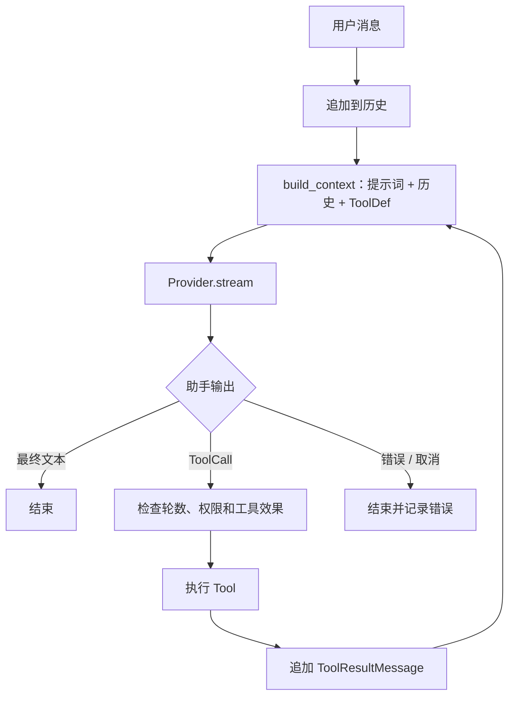

# 1. Agnet Loop 机制

流程

```mermaid
flowchart TD
    U["用户消息"] --> H["追加到历史"]
    H --> C["build_context：提示词 + 历史 + ToolDef"]
    C --> P["Provider.stream"]
    P --> R{"助手输出"}
    R -->|"最终文本"| F["结束"]
    R -->|"ToolCall"| G["检查轮数、权限和工具效果"]
    G --> T["执行 Tool"]
    T --> TR["追加 ToolResultMessage"]
    TR --> C
    R -->|"错误 / 取消"| E["结束并记录错误"]
```

**模型出答案，Agent 维护历史记录、调用模型、执行工具，并决定是否继续循环**
